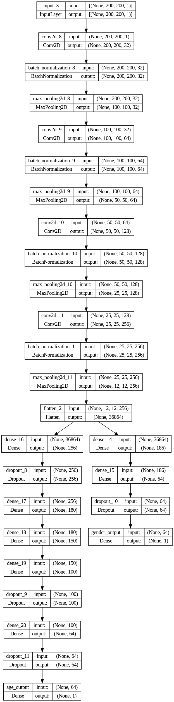

# Image Gender and Age Prediction

This project uses a machine learning model to predict the gender and approximate age from an uploaded image. The model is built using TensorFlow and served using Flask.


## Features

- Predicts gender (Male/Female) and approximate age from uploaded images.
- Supports images close to 200x200 pixels for accurate predictions.
- Web interface built with Flask for easy interaction.
## Dataset
```bash
https://www.kaggle.com/datasets/jangedoo/utkface-new
```

## Installation

- Install my-project

```bash
git clone https://github.com/your_username/image-gender-age-prediction.git
cd image-gender-age-prediction

```
- Make a folder directory for storing model with name 'model'. And copy the trained model in it.
- My trained model link or You can train your model from the collab File.
```bash
https://drive.google.com/file/d/11AmGIaK-rGP3AgI5mbtFhAUOqZuaYfXO/view?usp=sharing
```
    
## Environment Setup

```bash
python -m venv venv
source venv/bin/activate  # On Windows use `venv\Scripts\activate`
pip install -r requirements.txt
```

## Run the application

```bash
python app.py
```


## Uses

- Upload an image using the provided form.
- Click "Upload" to submit the image for prediction.
- View the predicted gender and age on the result page.
## Project Structure

- app.py: Flask application setup and routes.
- model/: Directory containing the trained machine learning model (model.h5).
- static/: Static files including uploaded images and CSS styles.
- templates/: HTML templates (index.html and result.html) for user interface.
## Demo
Visit this link for demo, Working of website and model.
```
https://youtu.be/M3UYmkB8RLI
```
[](https://www.youtube.com/watch?v=M3UYmkB8RLI)

## Model


